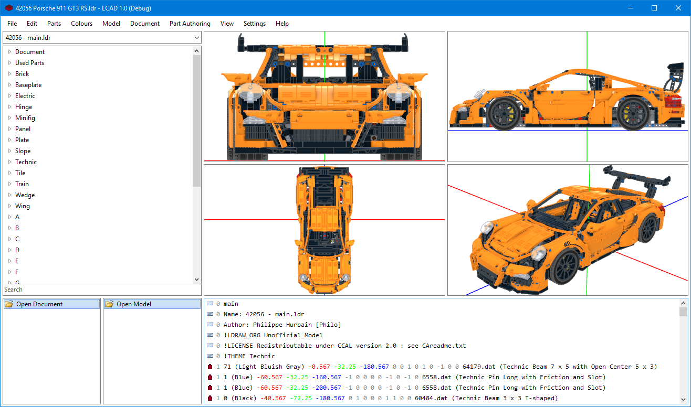
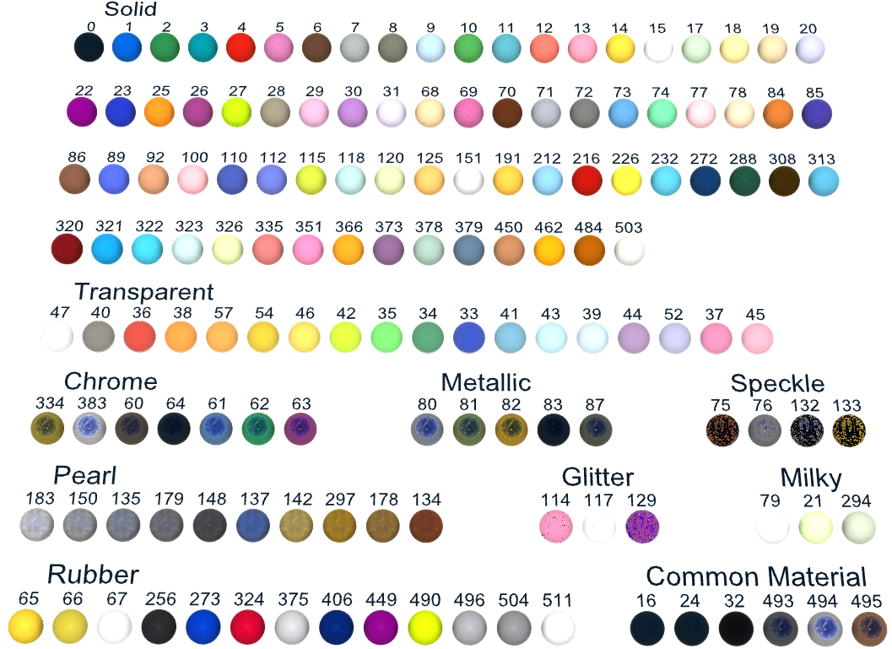
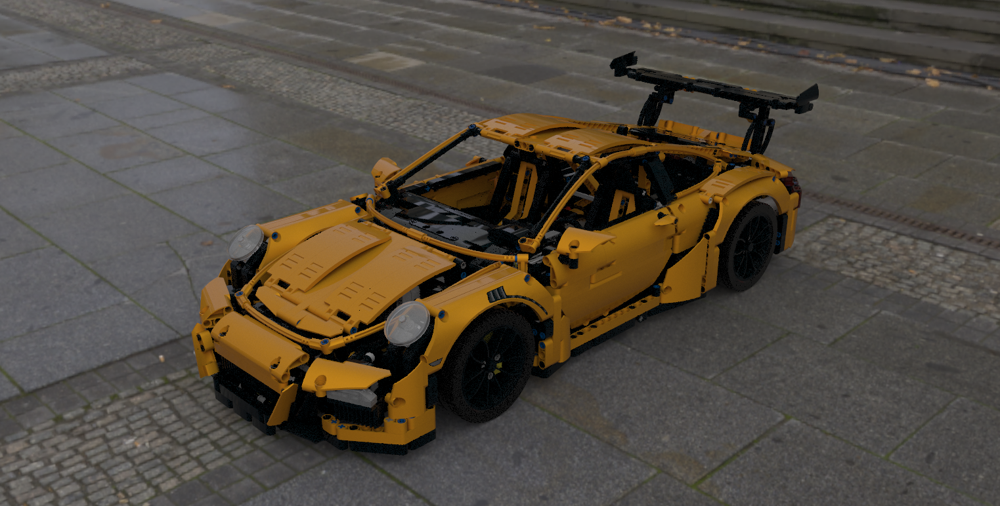
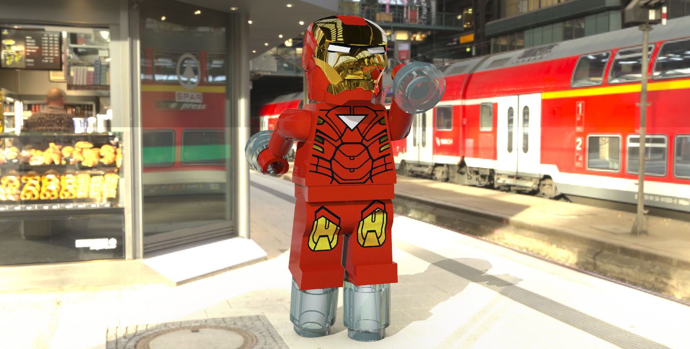
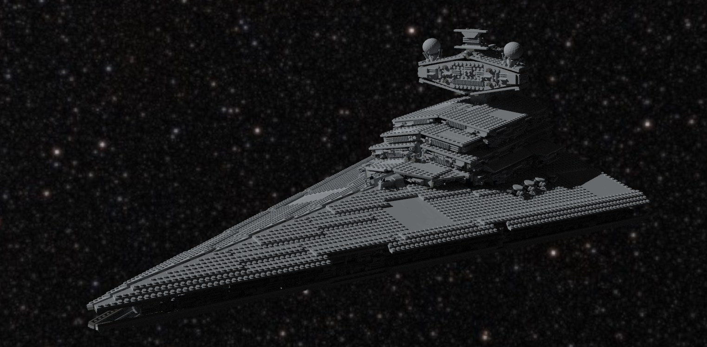
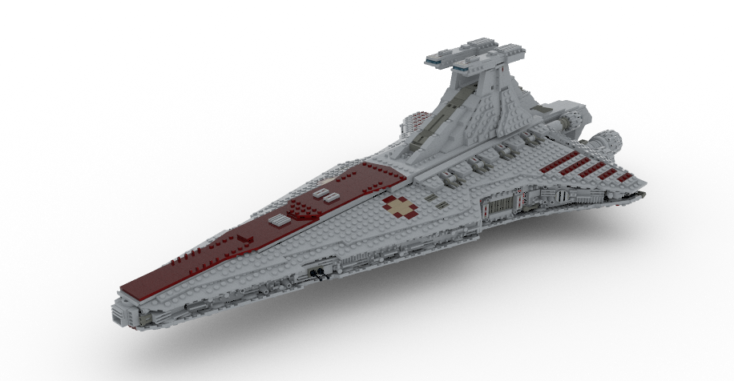
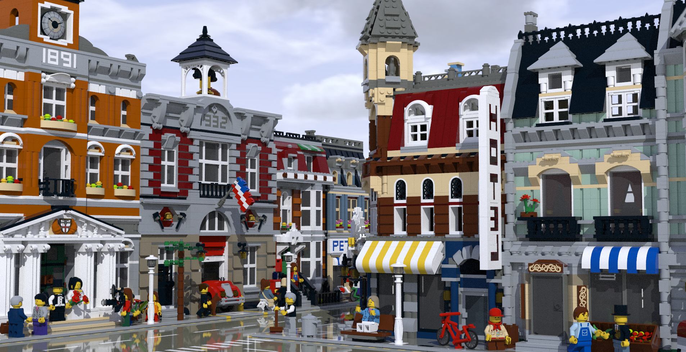
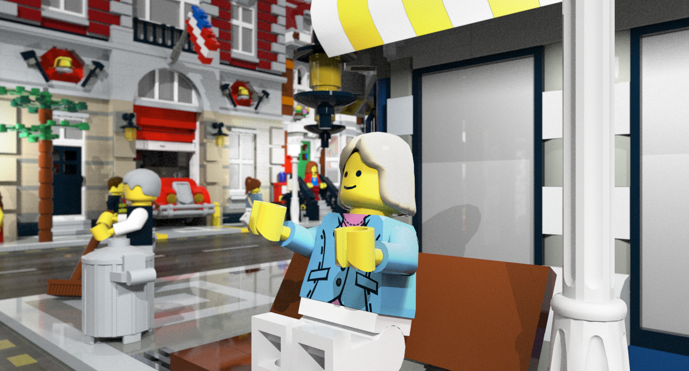
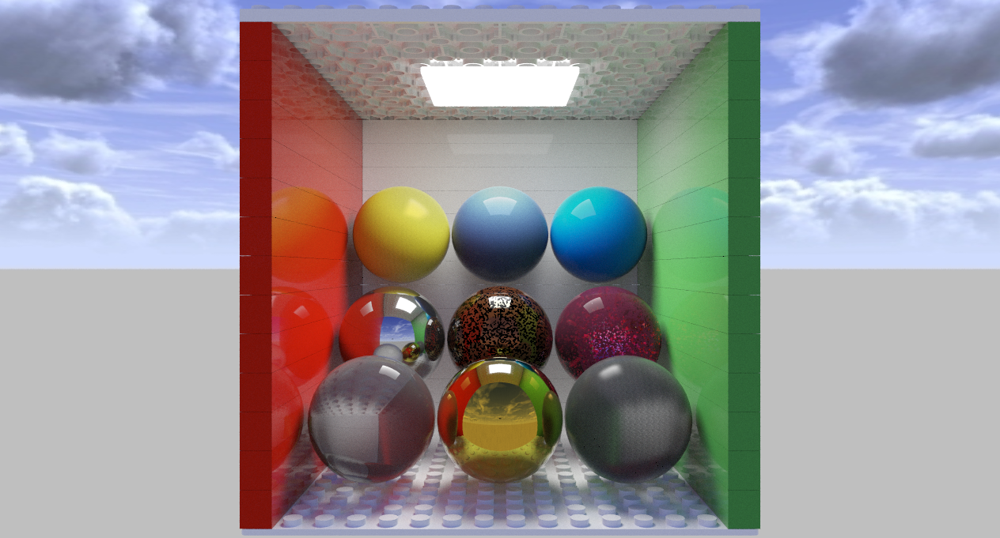

# LCAD

LCAD is an LDraw editor which lets you create virtual LEGO models on Windows.

## Features
- Realistic rendering of all LDraw colours (Glitter, Speckle, Metal, Chrome, Rubber, etc.)
- Support for the TEXMAP extension.
- Customisable part list categories
- Export parts lists and instructions.
- Rendering export with DirectX/OpenGL graphics or high quality Path Traced rendering.
- Open as many files as you like with tabbed documents.
- Parts list can be filtered based on search patterns.
- Full MPD (multi model) support.
- Unlimited undo/redo. This is separate for each model in a multi-model document.
- Unlimited editing viewports (viewports can also be created from the perspective of minifig heads and cameras).

## Download
Watch this space for a beta version 1.0 soon!

## Getting Started
First, head over to [LDraw.org](http://www.ldraw.org/) and run the All-In-One installer to get the LDraw parts library.
Then download and run LCAD. It should find the location you installed LDraw and open the parts library. You can start creating your first model!

## Requirements
- LCAD requires LDraw to be installed, it's easist to install the All-In-One Installer but you can also point LCAD to the directory of the LDraw folder.
- [.NET 4.7](https://www.microsoft.com/en-us/download/details.aspx?id=55170)
- DirectX 11 or OpenGL 3.3

## Screenshots
### LDraw Colours
This is a visual of all the supported LDraw materials rendered with the default renderer.

### Path Traced Render Examples
These are a few examples of models exported using Path Traced rendering. Each example uses a different environment map which can be loaded from any spherically mapped image (including HDR files). Right click and open image in a new tab to see bigger versions of each image.
This is a car rendered with an overcast environment.

Iron-man on a sunny station with a direct light.

A star destroyer lit with only a direct light.

No direct light here, only the white environment.

A direct light for the sun in an overcast environment.

A shot in the town showing camera depth of field effects for a 24mm lens at f/2.0. The scene is lit the same as above but also include an area light on each street lamp.

A render of the supported LDraw materials. From top left to bottom right: Rubber, Pearlescent (this is an old image from a version before textures where added), Normal ABS plastic, Chrome, Speckle, Glitter (with internal glitter flakes), Clear ABS, Gold Metal, Clear Rubber.

